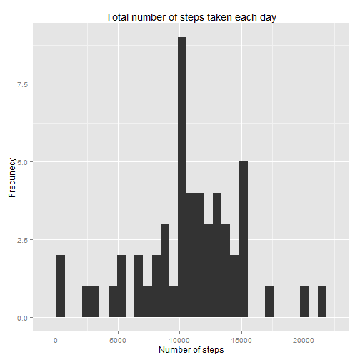
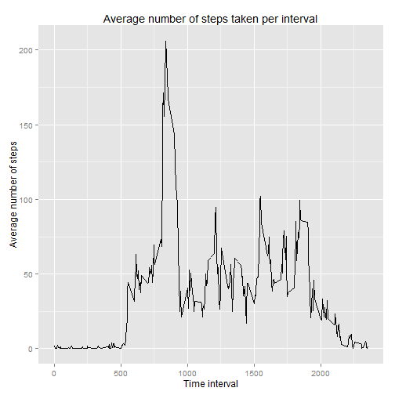
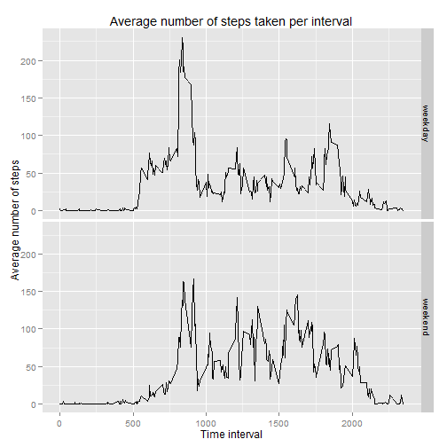

###1. Loading and preprocessing the data

Show any code that is needed to

1. Load the data (i.e. read.csv())

2. Process/transform the data (if necessary) into a format suitable for your analysis


```r
#Load the data
data <- read.csv("activity.csv")
head(data,5)
```

```
##   steps       date interval
## 1    NA 2012-10-01        0
## 2    NA 2012-10-01        5
## 3    NA 2012-10-01       10
## 4    NA 2012-10-01       15
## 5    NA 2012-10-01       20
```

###2. What is mean total number of steps taken per day?

For this part of the assignment, you can ignore the missing values in the dataset.

1. Calculate the total number of steps taken per day

2. If you do not understand the difference between a histogram and a barplot, research the difference between them. Make a histogram of the total number of steps taken each day

3. Calculate and report the mean and median of the total number of steps taken per day


```r
#Load packages
library(plyr)
```

```
## Warning: package 'plyr' was built under R version 3.1.3
```

```r
library(ggplot2)
```

```
## Warning: package 'ggplot2' was built under R version 3.1.3
```

```r
#Remove missing values from dataset
data_without_na <- na.omit(data)

#Calculate the total number of steps taken per day
total_steps_per_day <- ddply(data_without_na,"date",summarise,steps=sum(steps))
head(total_steps_per_day,5)
```

```
##         date steps
## 1 2012-10-02   126
## 2 2012-10-03 11352
## 3 2012-10-04 12116
## 4 2012-10-05 13294
## 5 2012-10-06 15420
```

```r
#Histogram of the total number of steps taken each day
qplot(steps, data=total_steps_per_day, geom="histogram", xlab = "Number of steps", ylab = "Frecunecy", main = "Total number of steps taken each day")
```

 

```r
#Calculate mean and median
mean_steps <- round(mean(total_steps_per_day$steps))
median_steps <- median(total_steps_per_day$steps)
```

Mean: 1.0766 &times; 10<sup>4</sup>   
Median: Mean: 10765

###3. What is the average daily activity pattern?

1. Make a time series plot (i.e. type = "l") of the 5-minute interval (x-axis) and the average number of steps taken, averaged across all days (y-axis)

2. Which 5-minute interval, on average across all the days in the dataset, contains the maximum number of steps?


```r
#Calculate the average number of steps taken per interval
average_steps_per_interval <- ddply(data_without_na,"interval",summarise,steps=mean(steps))
head(average_steps_per_interval,5)
```

```
##   interval     steps
## 1        0 1.7169811
## 2        5 0.3396226
## 3       10 0.1320755
## 4       15 0.1509434
## 5       20 0.0754717
```

```r
x <- average_steps_per_interval$interval
y <- average_steps_per_interval$steps

#Time series plot of average number of steps and time interval
qplot(x, y, data=average_steps_per_interval, geom="path", xlab = "Time interval", ylab = "Average number of steps", main = "Average number of steps taken per interval")
```

 

```r
#Interval with maximum number of steps
index <- which.max(average_steps_per_interval$steps)
max_minute_interval <- average_steps_per_interval$interval[index]
```

Maximum number of steps: 206   
Interval with the maximum number of steps: 835

###4. Imputing missing values

Note that there are a number of days/intervals where there are missing values (coded as NA). The presence of missing days may introduce bias into some calculations or summaries of the data.

1.- Calculate and report the total number of missing values in the dataset (i.e. the total number of rows with NAs)

2.- Devise a strategy for filling in all of the missing values in the dataset. The strategy does not need to be sophisticated. For example, you could use the mean/median for that day, or the mean for that 5-minute interval, etc.

3.- Create a new dataset that is equal to the original dataset but with the missing data filled in.

4.- Make a histogram of the total number of steps taken each day and Calculate and report the mean and median total number of steps taken per day. Do these values differ from the estimates from the first part of the assignment? What is the impact of imputing missing data on the estimates of the total daily number of steps?


```r
#Number of NAs in dataset
total_NAs <- length(which(is.na(data)))

#Subset data with missing values
data_with_na <- data[which(is.na(data)),]
data_with_na$steps <- NULL

#Replace NA values with average for step
newdata <- merge(data_with_na,average_steps_per_interval,by="interval")
newdata$steps <- round(newdata$steps)
data <- rbind(newdata, data_without_na)
data_without_na <- data[order(as.Date(data$date, format="%Y-%m-%d")),]

#Calculate the total number of steps taken per day
total_steps_per_day <- ddply(data_without_na,"date",summarise,steps=sum(steps))
head(total_steps_per_day,5)
```

```
##         date steps
## 1 2012-10-01 10762
## 2 2012-10-02   126
## 3 2012-10-03 11352
## 4 2012-10-04 12116
## 5 2012-10-05 13294
```

```r
#Histogram of the total number of steps taken each day
qplot(steps, data=total_steps_per_day, geom="histogram")
```

 

```r
#Calculate mean and median
mean_steps <- mean(total_steps_per_day$steps)
median_steps <- median(total_steps_per_day$steps)
```

Total number of NAs: 2304  

Replaced all the missing values with the average steps per interval from section 3.  

Mean: 1.0765 &times; 10<sup>4</sup>   
Median: 1.0762 &times; 10<sup>4</sup>

Replacing the missing values didn't have an important impact on the estimates of mean and median. This is mostly because we used the same average values too fill those missing values.

###5. Are there differences in activity patterns between weekdays and weekends?

For this part the weekdays() function may be of some help here. Use the dataset with the filled-in missing values for this part.

1. Create a new factor variable in the dataset with two levels - "weekday" and "weekend" indicating whether a given date is a weekday or weekend day.

2. Make a panel plot containing a time series plot (i.e. type = "l") of the 5-minute interval (x-axis) and the average number of steps taken, averaged across all weekday days or weekend days (y-axis). See the README file in the GitHub repository to see an example of what this plot should look like using simulated data.


```r
#Create a new factor for "weekday" and "weekend"
weekend <- c("sábado", "domingo")
data_without_na$day = as.factor(ifelse(is.element(weekdays(as.Date(data_without_na$date, format="%Y-%m-%d")),weekend), "weekend", "weekday"))

#Calculate the average steps per interval dependeing of the day value
average_steps_per_interval <- ddply(data_without_na,c("interval","day"),summarise,steps=mean(steps))

#Plot the average number of steps taken per interval depending of the value for day
qplot(interval, steps, data=average_steps_per_interval, facets=day~., geom="line", xlab="Time interval", ylab="Average number of steps", main="Average number of steps taken per interval")
```

 
